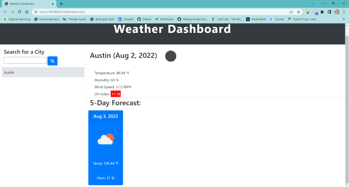

# City Weather Dashboard

## Deployed Application

## Description
* Enter in a city and search to view the current weather, temperature, humidity, wind speed, and UV Index for that city at the current time and date. Will also display the weather, temperature and hummidity forecast for the next five days.

* UV Index will be color coded to indicate the severity of the index. Favorable is shown in green, moderate is shown in yellow and severe is shown in red.

* Previous city searches are saved in localStorage and the five most recent searches are available as buttons in order to access and re-search the weather and forecasts

## Struggles
I struggled with creating the 5 day forecast wind speed element and appending it. I have yet to figure out the solution for it. I am also struggling with displaying the full five day forecast. It only shows one day ahead. I will continue to work on resolving this issue.

## Built with:
* HTML
* CSS
* Javascript
* Open Weather API
* Bootstrap
* jQuery
* Moment.js

## Screenshot
